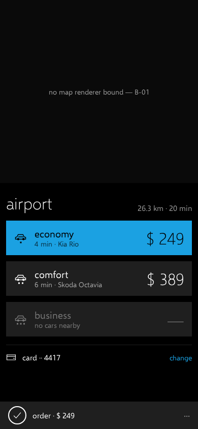
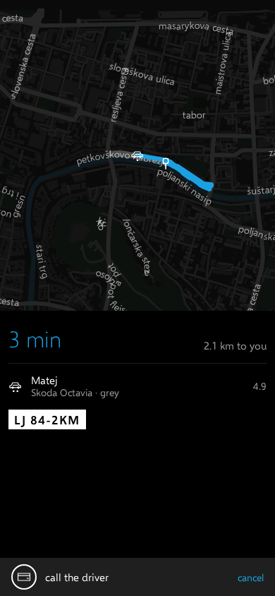
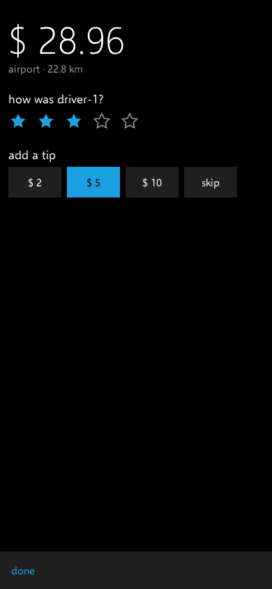
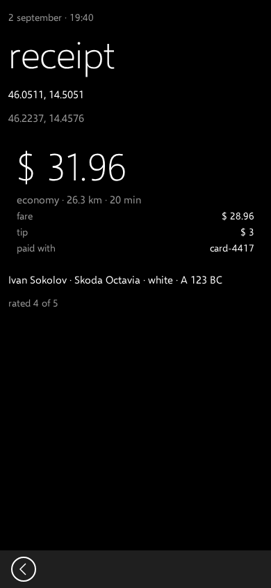
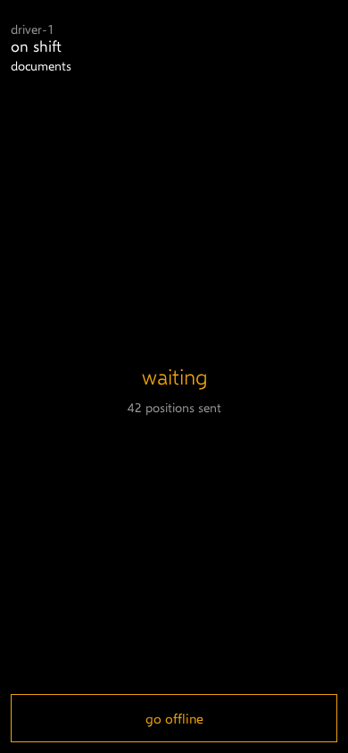
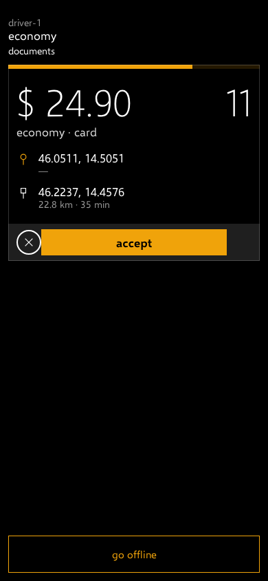
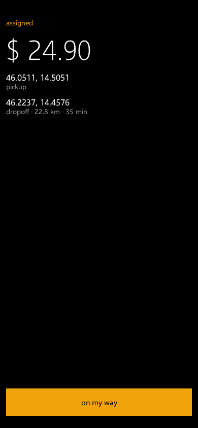
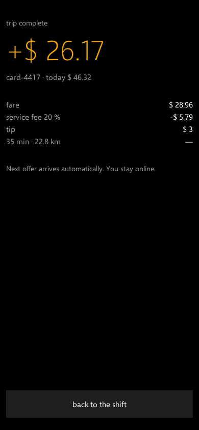
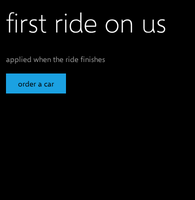

# shashki

A reference ride-hailing service — a rider client, a driver client and a dispatch server — built to
show the [kotlin.website](https://kotlin.website) stack working together on a domain anybody already
knows how to judge: a car was requested, a driver was assigned, the trip finished, the card was
charged once.

It is not a demo of one library. **The point is the seams.** An order is a saga that survives the
process dying halfway; the events it emits leave the same transaction as the state change; two
screens are sent by the server as component trees and drawn by the client's own renderers; the map is
drawn from the city's own tiles onto a Compose canvas because nothing else reaches Kotlin/Wasm; the
design is accepted by a screenshot suite that fails when the layout moves.

Both clients are Kotlin/Wasm bundles from one Compose Multiplatform source set, served by the server
they talk to.

## The rider

<p>
  
  
  
  
</p>

## The driver

<p>
  
  
  
  
</p>

**Every image here is a golden the suite verifies.** They are the files `./gradlew check` compares
against on every build, recorded on one machine and re-verified byte for byte on the others; if a
layout moves, the build goes red and these pictures are what changed.

## What it demonstrates

| The seam | Where it is |
|---|---|
| **An order is a saga.** Five phases, a hold taken before a driver is asked, compensation when the rider walks away — and the process can be killed between any two phases and resumed from the row | [`server/.../feature/ride/saga`](server/src/main/kotlin/io/github/youndie/shashki/server/feature/ride/saga), on [petich](https://github.com/youndie/petich) |
| **An offer is a suspended saga with a deadline.** Fifteen seconds, then the next candidate; nobody holds a connection open | [`OrderSteps.kt`](server/src/main/kotlin/io/github/youndie/shashki/server/feature/ride/saga/OrderSteps.kt) |
| **The event leaves the same transaction as the state change.** An outbox row written by the saga, relayed to a broker afterwards; with no broker configured the events stay unpublished and say so | [booblik](https://github.com/youndie/booblik) |
| **The money is one story told twice.** The rider's receipt and the driver's summary are both read from the settlement's own rows, so a fare, a cancellation fee and a tip cannot disagree between the two screens | [`feature/settlement`](server/src/main/kotlin/io/github/youndie/shashki/server/feature/settlement) |
| **Two screens are server-driven.** A promotion and the receipt arrive as component trees; the client draws them with its own renderers, applies the kit's composition rules, and degrades rather than blanks when a component type is one this build does not know | [kompot](https://github.com/youndie/kompot), [`ui/kompot`](shared-ui/src/commonMain/kotlin/io/github/youndie/shashki/ui/kompot) |
| **The map is ours.** MapLibre publishes nothing for Kotlin/Wasm, so the basemap is a pmtiles archive read over HTTP range requests and drawn tile by tile onto a Compose canvas — the same code on desktop and in the browser | [`ui/map`](shared-ui/src/commonMain/kotlin/io/github/youndie/shashki/ui/map), [bochka](https://github.com/youndie/bochka) |
| **The design is acceptance, not decoration.** Screens are photographed on the JVM target and verified everywhere; a font this repository does not ship is a failure rather than a surprise on somebody else's machine | [viddik](https://github.com/youndie/viddik), [kvadrant-ui](https://github.com/youndie/kvadrant-ui) |
| **Sign-in, crashes, metrics, traces and the e-mail receipt are real** — an OIDC provider, a crash reporter, a metrics collector, a tracing collector and an SMTP client over verified TLS, each wired or absent, and each absence logged with what it costs | [shildik](https://github.com/youndie/shildik), [katcher](https://github.com/youndie/katcher), [metrik](https://github.com/youndie/metrik), [tracy](https://github.com/youndie/tracy), [smtpkn](https://github.com/youndie/smtpkn) |



**When the server sends a component this build has never heard of**, the rest of the screen still
draws and the hole is reported to the client's degradation sink rather than left silent. That is a
golden too — the picture on the right is the test.

<br clear="all">

## Running it

The stand is the server, the two bundles it serves, and the five services it talks to: Postgres, an
identity provider, an object store, a broker and the two collectors.

```bash
bash map/city_tiles.sh                                    # the city: tiles, a routing graph, glyphs
./gradlew :server:image -PosmFile=build/city/Ljubljana.osm.pbf
docker compose -f docker/compose.yaml up -d
bash docker/bootstrap-shildik.sh                          # a realm and a client for sign-in
bash docker/bootstrap-documents.sh                        # a bucket for the driver's documents
bash docker/upload-tiles.sh build/city/city.pmtiles       # the basemap, where a browser can read it
```

| | |
|---|---|
| the rider | http://127.0.0.1:18080 |
| the driver | http://127.0.0.1:18080/driver |
| metrics · traces | http://127.0.0.1:19080 · http://127.0.0.1:19081 |

Without an image, `./gradlew :server:run` against a Postgres works and has no map, no broker and no
provider — each absence is logged at `warn` with what it costs, because a service that silently
measures nothing looks exactly like a service with no traffic.

The same clients run as desktop windows, which is how the screens above are photographed:

```bash
SHASHKI_SERVER=http://127.0.0.1:18080 \
  SHASHKI_TILES=http://127.0.0.1:19000/tiles/city.pmtiles \
  ./gradlew :rider:hotRunDesktop --mainClass=io.github.youndie.shashki.rider.MainKt
```

## The modules

| | |
|---|---|
| `:protocol` | the wire both halves read — routes as `@Resource` classes, the DTOs, the design tokens the server may name, and the components a server-driven screen is made of |
| `:server` | Ktor, Koin, Exposed, petich, GraphHopper. Serves the API and both bundles |
| `:shared-ui` | every screen, drawn once: Compose Multiplatform, the map, the kompot renderers, the goldens |
| `:rider` · `:driver` | the two applications — navigation, view models, DI — as `wasmJs` bundles with a `jvm("desktop")` target for the goldens |
| `:auth-client` · `:crash-client` | the browser halves of sign-in and crash reporting, kept apart from the applications that use them |

## The documentation

**`main` describes what exists; an open pull request describes what will be.** A feature that is
designed but not shipped is a draft in a branch, which is why there is no directory of intentions
here.

- [docs/research/research-architecture.md](docs/research/research-architecture.md) — what was
  verified against the stack's own artefacts, the decisions taken and why, and the risks with the
  machinery that mitigates each. Four of the brief's assumptions turned out to be wrong when checked,
  and each is recorded beside the artefact that disproved it
- [backlog.md](backlog.md) — every item, closed with what it turned out to be rather than with a tick
- [docs/](docs/) — the screens, the endpoints, the services and the features, each with its code
  anchors

## Checks

```bash
./gradlew check     # compile, test, ktlint, the goldens — and the wasm suite in a real
                    # browser where one is installed (scripts/install-chrome.sh), skipped with a
                    # line naming that script where it is not
make check          # the documentation gate: the index, the links, the coverage map, the chart
```

The suite is the argument, so it is worth saying what it holds: every screen against its golden on
both themes, every glyph against the bundled faces, the saga against a real Postgres at every phase
boundary, the DI graph resolved rather than declared, every route round-tripped through its own
address, and the money on each screen compared with what the payment gateway recorded.

## Language

Code, comments, test names, exception messages and commit subjects are in English, and so is this
documentation tree. The design kit and the product brief it was derived from are in Russian and stay
that way: they are evidence, and evidence is not translated.

## Licence

[MIT](LICENSE).
